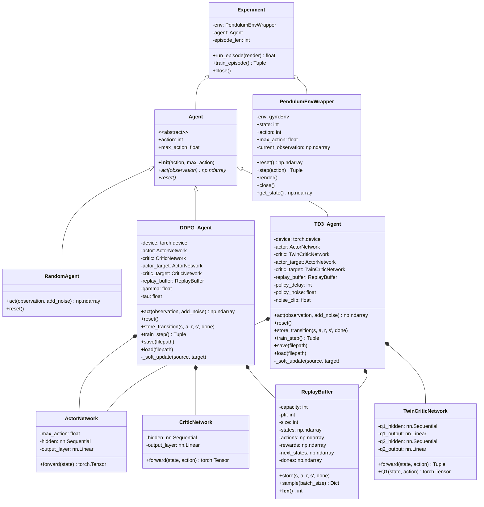

# Part 3 Pendulum - UML 類別圖

## Class Diagram

---

## 如何查看 UML 圖

### 方法 1：VS Code 擴展
1. 安裝 **"Markdown Preview Mermaid Support"** 擴展
2. 打開此檔案，按 `Ctrl+Shift+V` 預覽

### 方法 2：線上工具
1. 打開 https://mermaid.live/
2. 複製上面的 mermaid 代碼貼上
3. 即可看到 UML 圖

### 方法 3：GitHub
- 直接把這個 .md 檔案 push 到 GitHub，GitHub 會自動渲染 Mermaid 圖表
